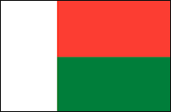

[comment]: # (Start README.md markdown script)
<!-- 
  __  __           _                                      
 |  \/  |         | |                                     
 | \  / | __ _  __| | __ _  __ _  __ _ ___  ___ __ _ _ __ 
 | |\/| |/ _` |/ _` |/ _` |/ _` |/ _` / __|/ __/ _` | '__|
 | |  | | (_| | (_| | (_| | (_| | (_| \__ \ (_| (_| | |   
 |_|  |_|\__,_|\__,_|\__,_|\__, |\__,_|___/\___\__,_|_|   
                            __/ |                         
                           |___/                                                                                                                                                 
-->

# Madagascar Nationalism and Imperialism Web Page

## Description

This web app is a project for history focused on Nationalism and Imperialism in Madagascar.

## Features

- [x] Accordion
- [x] Tabs
- [x] Images
- [x] Information
- [x] Captions for Images
- [x] Loading Bar
- [x] Fully Functioning jQuery Animations
- [x] Beautiful ASCII Text Art
- [x] Custom Scrollbar
- [ ] Code to English Comments (coming soon)

## Rubric Checklist

- [x] Which country invaded? 
- [x] When did they invade? 
- [x] Why did they invade? 
- [x] How did the foreign invader permanently change the country? When did the country gain their independence? 
- [x] How did nationalism influence the development of the country? 
- [x] How did the country fight off foreign invaders? 
- [ ] ~~If the country attempted to expand, when and where did they expand, and why did it fail? How did the neighboring countries hamper the country's expansion attempts.~~
- [ ] ~~Which foreign countries did they invade?~~
- [ ] ~~When did the country start their foreign expansion?~~ 
- [ ] ~~Why did the country expand into foreign countries?~~
- [ ] ~~How did the country change the areas they conquered? When and why did the country leave their foreign territories?~~
- [x] Something unique or interesting about the culture of the Country.
- [x] A List of the sources you used in finding information - Minimum of 4 sources
- [x] A current flag of the Country
- [x] Information about the current government including background information about the Current leader/leaders
- [x] How the Country was affected by Imperialism/Nationalism. Use the Conquered/Conquerors questions as a guide.
- [x] If the country was conquered by a foreign country, answer the following questions
- [x] A current map of the Country 
- [x] Professional
- [x] Accurate
- [x] Complete

## How to Execute

1. Open the the test folder
2. Open the index.html file with Google Chrome
3. Done!

## How to Use

1. Press the reload button if needed (only to see the scrollbar)
2. Press the start button
3. Click on any one of the accordion sectional tabs
4. Explore!   

## Plugins Used

+ [jQuery][1]
- [jQuery UI][2]
* [PACE Loading Bar][3]

[1]: http://www.jquery.com/  "jQuery"
[2]: http://www.jqueryui.com/  "jQuery UI"
[3]: http://github.hubspot.com/pace/docs/welcome/  (PACE Loading Bar)

Browser Compatibility
---------------------

[//]: # (start table)
|     Edge/IE     |    Safari    |      Chrome      |   Firefox  |    Opera    |
|-----------------|--------------|------------------|------------|-------------|
|not compatible :(|6.1.6 or later|34.0.1847 or later|1.3 or later|8.xx or later|
[//]: # (end table)

Version Info
-------------
+ 1.xx1: Initiated code base
- 1.xx2: Updated code base
* 1.xx3: Added images
+ 1.xx4: (Current Version) Added Effects

________

> **_Enjoy!_**

[comment]: # (End README.md markdown script)